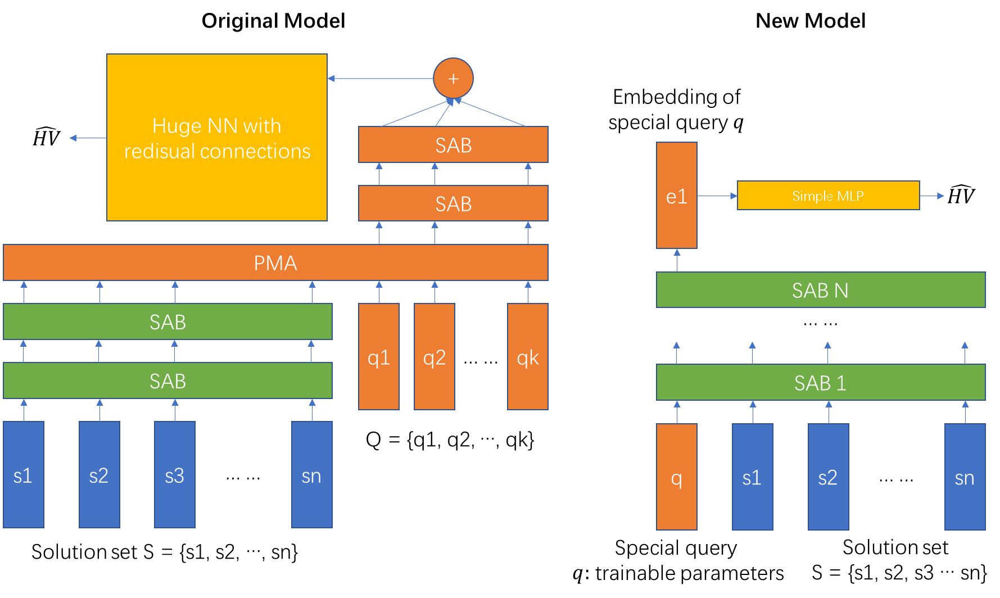
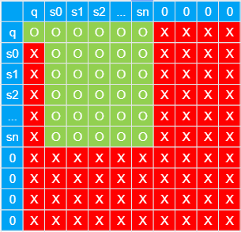
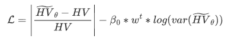

# STHV-Net
STHV-Net: Hypervolume Approximation based on Set Transformer

**ACKNOWLEDGEMENT**
This project was formerly attempted by Mr. Weiyu Chen during his studies at SUSTech. Therefore, the authors of this paper would like to express their gratitude to him for his attempt and effort on this project.

## **Notes For Original Results**

For whom might be interested in reproducing the results in the paper, please use the `STHV-Net-...` models in `models/M[objective_num]/old/*`.  **To make sure the accuracy of approximation, solution sets with sizes less than 100 should to be supplemented with 0 vectors until their size reaches 100**

## Notes For More Advanced Results

For whom might be interested in using the model or might be interested in our more advanced results, please use the `MaskedModels-*` models in `models/M[objective_num]/*`.

Compared with `STHV-Net`:

​	 we first modify the codes of Set Transformer to ignore the 0 vectors in the input sets (Sequence Mask). Hence input sets do not need to be supplemented by 0 vectors anymore.

​	Then we redesign the network. The decoder module of Set Transformer is removed, and the scale of the decoder module of the original STHV-Net is significantly reduced. Then we add a trainable query to the input set to aggregate features (Yes, like the [CLS] token in language models). The comparison results of the new and old model are as follows

​	The mask strategy is shown in the following figure, where an `X` in position `(a, b)` indicates that `a` should not be noticed the existence of `b`, while an `O` indicates the contrary:

​	By modifying the loss function, we are now able to optimize the whole network under the guidance of the absolute percentage hypervolume error (direct objective). A penalty term (related to the variance of outputs) is added to the percentage hypervolume error and it decays with training epoch count, and thus the network cannot ignore inputs and output 0s in all cases to stuck the training process (a gradient clip will make the training more stable too). The new loss function is shown in the following formula, we set $\beta_0=0.1$ and $w=0.8$. 

​	By incorporating all the techniques mentioned above, the new model can achieve much better performance than the original model. The approximation loss is reported in the following form.

| m    | MaskedModel-2 | MaskedModel-4 |
| ---- | ------------- | ------------- |
| 3    | 0.006501181   | 0.003959356   |
| 5    | 0.010560866   | 0.005913415   |
| 8    | 0.020963149   | 0.011213395   |
| 10   | 0.015287789   | 0.008637283   |

